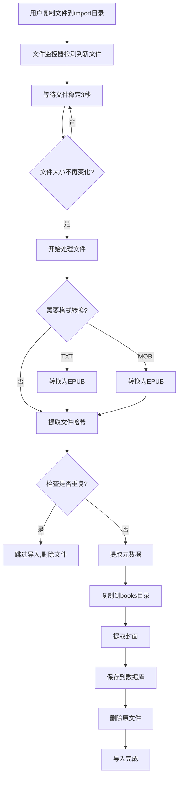

# 自动导入功能文档

## 📚 功能介绍

自动导入功能允许你通过简单地将电子书文件复制到指定目录，系统就会自动检测、导入并处理这些文件。导入成功后，原文件会被自动删除，保持目录清洁。

### 主要特性

- ✅ **自动检测**：实时监控 `import` 目录，自动发现新文件
- ✅ **智能处理**：自动提取元数据（书名、作者、简介等）
- ✅ **封面提取**：自动从 EPUB 和 PDF 文件中提取封面图片
- ✅ **格式转换**：自动将 TXT 和 MOBI 文件转换为 EPUB 格式
- ✅ **去重检测**：基于文件哈希自动检测重复书籍
- ✅ **自动清理**：导入成功后自动删除原文件
- ✅ **批量导入**：支持一次性复制多个文件进行批量导入

### 支持格式

- **EPUB** - 电子出版物格式
- **PDF** - 便携式文档格式
- **TXT** - 纯文本格式（自动转换为EPUB）
- **MOBI** - Kindle格式（自动转换为EPUB，需要Calibre）

## 🚀 使用方法

### Docker 部署

#### 1. 确认 import 目录已挂载

检查 `docker-compose.yml` 中是否包含 import 目录的挂载：

```yaml
services:
  backend:
    volumes:
      - /volume5/docker/bookpath/import:/app/import
```

#### 2. 设置目录权限（首次使用）

```bash
# 运行权限修复脚本
sudo ./fix-docker-permissions.sh

# 或手动创建并设置权限
sudo mkdir -p /volume5/docker/bookpath/import
sudo chmod 777 /volume5/docker/bookpath/import
```

#### 3. 复制文件到 import 目录

```bash
# 单个文件
cp /path/to/your/book.epub /volume5/docker/bookpath/import/

# 多个文件
cp /path/to/books/*.epub /volume5/docker/bookpath/import/

# 使用 scp 从远程复制
scp user@remote:/path/to/book.epub /volume5/docker/bookpath/import/
```

#### 4. 等待自动导入

系统会在 3-5 秒内检测到新文件并开始处理。你可以通过以下方式查看进度：

```bash
# 查看后端日志
docker-compose logs -f backend | grep "自动导入"

# 应该看到类似输出：
# [文件监控] 发现新文件: book.epub (2.5 MB)
# [自动导入] 开始处理文件: book.epub
# [自动导入] EPUB元数据提取成功: 书名
# [自动导入] EPUB封面提取成功: /books/public/xxx/cover.jpg
# [自动导入] 导入成功: 书名 (ID: xxx)
# [自动导入] 已删除原文件: /app/import/book.epub
```

### 本地开发环境

#### 1. 确认 import 目录

```bash
cd backend
mkdir -p import
```

#### 2. 复制文件

```bash
cp /path/to/your/book.epub ./backend/import/
```

#### 3. 查看控制台输出

在运行 `npm run dev` 的控制台中查看导入日志。

## 📋 工作流程



## 🔍 详细处理步骤

### 1. 文件检测

- 系统每 5 秒扫描一次 `import` 目录
- 只检测支持的文件格式（.epub, .pdf, .txt, .mobi）
- 文件必须稳定（大小不变）3 秒才会被处理（避免处理正在复制的文件）

### 2. 格式转换

- **TXT 文件**：
  - 使用文件名作为书名
  - 作者设置为"未知作者"
  - 自动转换为 EPUB 格式
  
- **MOBI 文件**：
  - 使用 Calibre 的 ebook-convert 工具转换
  - 保留原始元数据
  - 转换为 EPUB 格式

### 3. 重复检测

- 基于文件内容计算 SHA256 哈希值
- 与数据库中现有书籍对比
- 如果发现重复，跳过导入并删除文件

### 4. 元数据提取

- **EPUB 文件**：
  - 从 content.opf 提取标题、作者、简介等
  - 从 metadata 中查找封面图片
  
- **PDF 文件**：
  - 使用 pdf-parse 提取文档属性
  - 提取标题、作者、主题等信息

### 5. 文件存储

- 在 `books/public/` 目录下为每本书创建独立目录
- 使用 UUID 作为目录名
- 书籍文件统一命名为 `book.{ext}`

### 6. 封面提取

- **EPUB**：
  - 从 ZIP 包中提取封面图片
  - 支持多种封面识别方式
  - 保存为 `cover.jpg` 或 `cover.png`
  
- **PDF**：
  - 使用 canvas 将第一页渲染为图片
  - 保存为 `cover.jpg`

### 7. 数据库记录

保存以下信息到数据库：
- 书籍ID（UUID）
- 元数据（书名、作者、简介等）
- 文件路径和大小
- 文件哈希
- 封面URL
- 创建时间

### 8. 清理

- 删除 import 目录中的原始文件
- 删除转换过程中产生的临时文件

## ⚙️ 配置选项

### 环境变量

在 `docker-compose.yml` 或 `.env` 文件中配置：

```env
# 导入目录路径
IMPORT_DIR=./import

# 书籍存储目录
BOOKS_DIR=./books
```

### 轮询间隔

默认每 5 秒扫描一次。如需修改，编辑 `backend/src/utils/fileWatcher.ts`：

```typescript
globalWatcher = new FileWatcher({
  importDir,
  pollInterval: 5000, // 修改这里，单位：毫秒
  supportedExtensions: ['.epub', '.pdf', '.txt', '.mobi'],
});
```

### 文件稳定时间

默认文件必须稳定 3 秒。如需修改，编辑 `backend/src/utils/fileWatcher.ts`：

```typescript
private readonly STABLE_DURATION = 3000; // 修改这里，单位：毫秒
```

## 📊 监控和日志

### 查看导入状态

```bash
# Docker环境
docker-compose logs -f backend | grep "自动导入\|文件监控"

# 本地开发
# 在运行dev的控制台中查看
```

### 日志类型

- `[文件监控]` - 文件检测相关日志
- `[自动导入]` - 文件处理相关日志
- `[EPUB元数据提取]` - EPUB处理日志
- `[PDF封面提取]` - PDF处理日志

### 日志示例

#### 成功导入

```
[文件监控] 发现新文件: 三体.epub (2.5 MB)
[自动导入] 开始处理文件: 三体.epub
[自动导入] EPUB元数据提取成功: 三体
[EPUB封面提取] 开始处理封面: { bookDir: '/app/books/public/xxx', coverPath: 'OEBPS/Images/cover.jpg' }
[EPUB封面提取] 目录可写
[EPUB封面提取] 封面文件已写入
[EPUB封面提取] 封面文件验证成功
[自动导入] EPUB封面提取成功: /books/public/xxx/cover.jpg
[自动导入] 书籍已保存到数据库: { id: 'xxx', title: '三体', author: '刘慈欣' }
[自动导入] 已删除原文件: /app/import/三体.epub
[自动导入] 导入成功: 三体 (ID: xxx)
```

#### 重复文件

```
[文件监控] 发现新文件: 三体.epub (2.5 MB)
[自动导入] 开始处理文件: 三体.epub
[自动导入] 文件已存在，跳过导入: 三体
[自动导入] 已删除原文件: /app/import/三体.epub
```

#### 处理失败

```
[文件监控] 发现新文件: book.epub (1.2 MB)
[自动导入] 开始处理文件: book.epub
[自动导入] EPUB元数据提取失败: Invalid EPUB file
[自动导入] 导入失败: book.epub EPUB元数据提取失败: Invalid EPUB file
[文件监控] 文件处理失败，标记为已处理: /app/import/book.epub
```

## 🔧 故障排除

### 问题1：文件未被检测到

**可能原因：**
- import 目录不存在或无权限
- 文件正在复制中（未稳定）
- 文件格式不支持

**解决方案：**
```bash
# 检查目录权限
ls -la /volume5/docker/bookpath/import

# 确保权限正确
sudo chmod 777 /volume5/docker/bookpath/import

# 检查文件是否完整
ls -lh /volume5/docker/bookpath/import/

# 查看监控状态（通过API）
curl http://localhost:1201/api/import/status
```

### 问题2：导入失败

**可能原因：**
- 文件损坏
- 权限不足
- 磁盘空间不足
- 缺少依赖（MOBI转换需要Calibre）

**解决方案：**
```bash
# 查看详细错误日志
docker-compose logs backend | grep "自动导入"

# 检查磁盘空间
df -h

# 检查目录权限
docker exec -it knowbooks-backend ls -la /app/books/public

# 测试文件是否有效
docker exec -it knowbooks-backend sh
unzip -t /app/import/book.epub  # 测试EPUB文件
```

### 问题3：MOBI转换失败

**原因：**
MOBI 转换需要 Calibre 工具，但 Docker 镜像中未包含。

**解决方案：**

**方案1：先转换再导入（推荐）**
```bash
# 在宿主机上安装 Calibre
brew install --cask calibre  # macOS
sudo apt install calibre      # Ubuntu/Debian

# 手动转换
ebook-convert book.mobi book.epub

# 导入 EPUB 文件
cp book.epub /volume5/docker/bookpath/import/
```

**方案2：在Docker中安装Calibre**

修改 `backend/Dockerfile`，在运行时依赖部分添加：
```dockerfile
RUN apk add --no-cache calibre
```

### 问题4：封面未提取

**可能原因：**
- EPUB 文件中没有封面
- 封面路径不标准
- 目录权限问题

**解决方案：**
```bash
# 查看封面提取日志
docker-compose logs backend | grep "EPUB封面提取"

# 检查书籍目录
ls -la /volume5/docker/bookpath/books/public/{book-id}/

# 如果目录不可写，修复权限
sudo chmod -R 777 /volume5/docker/bookpath/books/
```

### 问题5：文件未被删除

**可能原因：**
- 导入过程出错
- 权限不足

**检查方法：**
```bash
# 查看文件是否还在
ls -la /volume5/docker/bookpath/import/

# 如果文件还在但已导入，手动删除
rm /volume5/docker/bookpath/import/book.epub
```

## 🎯 最佳实践

### 1. 文件命名

建议使用清晰的文件名，便于识别：
```
✅ 三体-刘慈欣.epub
✅ The Three-Body Problem.epub
❌ book1.epub
❌ download (1).epub
```

### 2. 批量导入

一次性导入多个文件时：
```bash
# 先复制到临时目录
cp /source/*.epub /tmp/books/

# 再移动到 import 目录（移动比复制快）
mv /tmp/books/*.epub /volume5/docker/bookpath/import/
```

### 3. 使用同步工具

配合文件同步工具实现自动化：

**Syncthing 示例：**
1. 在手机/电脑上安装 Syncthing
2. 配置同步到 import 目录
3. 添加文件后自动同步并导入

**群晖 Cloud Sync 示例：**
1. 配置 Cloud Sync 同步云盘到 import 目录
2. 云盘中的电子书自动导入

### 4. 监控导入结果

创建简单的监控脚本：
```bash
#!/bin/bash
# check-import.sh

IMPORT_DIR="/volume5/docker/bookpath/import"

while true; do
  COUNT=$(ls -1 "$IMPORT_DIR" 2>/dev/null | wc -l)
  if [ $COUNT -gt 0 ]; then
    echo "[$(date)] 检测到 $COUNT 个待导入文件"
  fi
  sleep 60
done
```

### 5. 定期清理

虽然系统会自动删除导入成功的文件，但建议定期检查：
```bash
# 清理可能的临时文件
find /volume5/docker/bookpath/import -name "*.tmp" -delete
find /volume5/docker/bookpath/import -name "*.part" -delete
```

## 📈 性能优化

### 大文件处理

对于大文件（>100MB）：
1. 确保有足够的磁盘空间（至少是文件大小的 2 倍）
2. 适当增加文件稳定检测时间
3. 考虑在低峰时段导入

### 并发导入

系统按顺序处理文件，如需提高速度：
1. 减少轮询间隔（需要修改代码）
2. 使用更快的存储介质（SSD）
3. 分批导入，避免一次性复制大量文件

## 🔗 相关文档

- [Docker 部署指南](./DOCKER.md)
- [Docker 故障排除](./DOCKER_TROUBLESHOOTING.md)
- [API 文档](./README.md#api文档)

## 💡 高级用法

### API 接口

系统提供了 API 接口来管理自动导入功能（计划中）：

```bash
# 查看导入状态
GET /api/import/status

# 手动触发扫描
POST /api/import/scan

# 查看导入历史
GET /api/import/history
```

### Webhook 通知

可以在导入完成后发送通知（需要自行实现）：
1. 监听 `fileDetected` 事件
2. 在导入成功后调用 webhook
3. 发送到企业微信、钉钉、Slack 等

## 📝 更新日志

- **2025-12-11**：首次发布自动导入功能
  - 支持 EPUB、PDF、TXT、MOBI 格式
  - 自动元数据提取
  - 自动封面提取
  - 重复检测
  - 自动清理

---

如有问题或建议，请提交 [Issue](https://github.com/your-username/KnowBooks/issues)。
